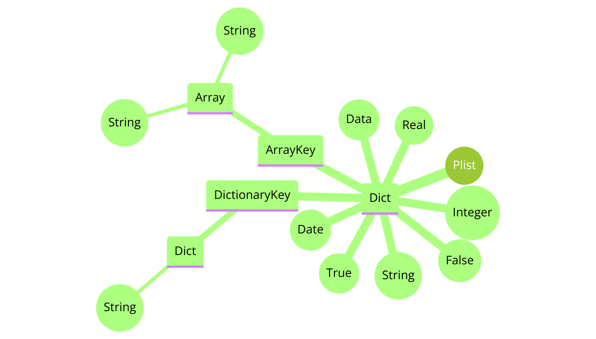

# Property Lists in Swift on macOS and iOS

## What are property lists and what are they used for in the Apple eco system ?
Property List files, are a type of configuration file that are very commonly used in macOS and iOS applications. They store, for example, user settings, application configurations and system information in a key–value structured format. `.plist` files contain various data types such as _dictionaries, arrays, strings, Boolean_ values and _numbers_. In addition they can also can contain `date` and `data` values to wrap nearly all important data types. 
They are usually saved either in XML format or as binary files. I.e. audio, video or image files are wrapped as data types.

Related [DTD link](http://www.apple.com/DTDs/PropertyList-1.0.dtd) to get the complete language definition to possible Apple´s .pist content format description.

Using `.plist` files in Swift is a common practice for managing configuration data in iOS and macOS applications.

Here's a commonly used approach how to read and parse `.plist` files in Swift:

1. Reading and evaluating .plist files in swift, you first need to determine its path. If the file is part of your project, you can use `Bundle.main.path(forResource:ofType:)` to get the path to the file. If you use the plistReader script on commandline, the `.plist` file has to be located in the same folder as the script.
2. Reading the data once you have the path to the file, you can read its contets into a data object. This is done by using `FileManager.default.contents(atPath:)`.
3. Serializing the data to convert the binary or XML data into Swift structures, use `PropertyListSerialization.propertyList(from:options:format:)`. This method attempts to deserialize the raw data into a Swift-compatible format (usually a _dictionary_ or _array_).
4. Evaluating the data after serialization, you can access the converted data and use it according to your application logic. Since `.plist` files mosly contain dictionary structures, access is typically done through key-value pairs.
## Predecisions and preliminary considerations
### Deserialization with `PropertyListSerialization` creates `NSObject` class items
This has advantages and disadvantages. As one major disadvantage the deserialization of a boolean property, with the swift values of `true` or `false` is mapped to `1` or `2`, which can't be distinguished from the integer values `1` and `2`. That's one reason, why our `plistReaderScript` is using the NSObject class types to get the correct type values from the `.plist` file deserialization.

## The project contains
- `main.swift` executable command line script
- `collections.plist` example property list containing additionaly nested collections, like arrays and dictionaries
- `primitives.plist` simple example array of terminal primitive values, like integer, floating point numbers, strings and booleans.
## Property list reader script
The example project swift script shows in detail which special features must be taken into account in the interaction of the used Swift classes and the underlying Foundation and Core Foundation objects.

## How it works
### 1. Import required framework
```swift
import Foundation
```
We have import the `Foundation` framework because the `PropertyListSerialization` used in our program is an `NSObject` class.
### 2. Define the output structure and type info level

```swift
var indentSpace = ""
let indentValue = "    "
let scriptSourceDefaultPath = "./"

let printflag_swiftType = PrintFlag.on
let printflag_objectClassType = PrintFlag.on
let printflag_ObjectClassTypeName = PrintFlag.on
let printflag_separator = PrintFlag.on

enum PrintFlag {
  case on
  case off

  var isOn: Bool {
    switch self {
    case .on:
      return true
    case .off:
      return false
    }
  }
}

func printWithIndent(_ info: String, toggle: PrintFlag = .on) {
  if toggle.isOn {
    print("\(indentSpace)\(info)")
  }
}
```
The properties are displayed with key, value and type in a clearly arranged output format. In particular, nested arrays and dictionaries are shown with their respective hierarchy levels.
### 3. Find the type of related item from `.plist` data file

```swift
/// Collect  item type from NSObject plist element and return respective Swift type
/// - Parameter item: dictionary element
/// - Returns: Swift type
func getCollectionType<T>(item: Any, valueWithType: T) -> T {

    var plistElementType: Any
    let valueWithObjectType = valueWithType as! NSObject

    let typeID = CFGetTypeID(valueWithObjectType)
    switch typeID {
    case CFBooleanGetTypeID():
        printWithIndent("### Bool", toggle: printflag_swiftType)
        printWithIndent("Object class TypeID: \(typeID)", toggle: printflag_swiftType)
        plistElementType = Bool.self
    case CFDictionaryGetTypeID():
        printWithIndent("### Dictionary", toggle: printflag_swiftType)
        printWithIndent("Object class TypeID: \(typeID)", toggle: printflag_objectClassType)
        plistElementType = Dictionary<String, Any>.self
    case CFArrayGetTypeID():
        printWithIndent("### Array", toggle: printflag_swiftType)
        printWithIndent("Object class TypeID: \(typeID)", toggle: printflag_objectClassType)
        plistElementType = Array<Any>.self
    case CFDataGetTypeID():
        printWithIndent("### Data", toggle: printflag_swiftType)
        printWithIndent("Object class TypeID: \(typeID)", toggle: printflag_objectClassType)
        plistElementType = Data.self
    case CFDateGetTypeID():
        printWithIndent("### Data", toggle: printflag_swiftType)
        printWithIndent("Object class TypeID: \(typeID)", toggle: printflag_objectClassType)
        plistElementType = Date.self
    case CFStringGetTypeID():
        printWithIndent("### String", toggle: printflag_swiftType)
        printWithIndent("Object class TypeID: \(typeID)", toggle: printflag_objectClassType)
        plistElementType = String.self
    case CFNumberGetTypeID():
        printWithIndent("Object class TypeID: \(typeID)", toggle: printflag_objectClassType)
        let valueWithNumberObjectType = valueWithType as! NSNumber
        let numberType = CFNumberGetType(valueWithNumberObjectType).rawValue
        if CFNumberIsFloatType(valueWithNumberObjectType) {
            plistElementType = Double.self
            printWithIndent("### Number Float: \(numberType)", toggle: printflag_objectClassType)
        } else {
            plistElementType = Int.self
            printWithIndent("### Number Integer: \(numberType)", toggle: printflag_objectClassType)
        }
    default:
        plistElementType = Any.self
        printWithIndent("Object class TypeID-default: \(typeID)", toggle: printflag_objectClassType)
    }
    return plistElementType.self as! T
}
```
The method maps the `.plist` elements Core Foundation Types CFTypeID to the corresponding Swift type. As already mentioned, this is necessary because the serialized property list that we have read in from the `.plist` file is now available to us in the Core Foundation type system. This is particularly important for data types such as Boolean and Numbers, as integer and Boolean values, for example, cannot be uniquely assigned to each other.

The printflags `printflag_swiftType` and `printflag_objectClassType` can be used to easily control what should appear and not to clutter up the output. But we also have more information if needed.

The CFType, which we have mapped to the Swift type system, is returned cast to the expected generic input type `T`.

#### What exactly happens here in the cast ?

For example, if we have an `__NSCFBoolean`, at runtime this is typed as `NSNumber` but may actually be an instance of `__NSCFBoolean` it represents a boolean value. By casting the value to a Swift `Bool` thanks to Swift's interoperability with Objective-C and its automatic handling of Foundation types like NSNumber, it results in a Swift `Bool` type with the values of `true` or `false` instead of `1` and `0` from `NSNumber` bools.

Now we got all types from our serialized input `.plist` file as related Swift type values:

`array` | `data` | `date` | `dict` | `real` | `integer` | `string` | `true` | `false`

### 4. Create content information
```swift
/// Create Collection Type
/// - Parameters:
///   - item: deserialized plist item as Core Foundation dictionary
///   - collectionType: collection type dictionary object
///   - genericElementValue: generic element value
/// - Returns: item key, value and type as dictionary
func collectionType<CollectionType>(
  of item: Any, collectionType: CollectionType, genericElementValue: Any
) -> CollectionType {
  let typeAsString = String(describing: type(of: genericElementValue))
  let collectionType = getCollectionType(item: item, valueWithType: genericElementValue)
  var elementValue = genericElementValue
  printWithIndent("Object class type name: \(typeAsString)", toggle: printflag_ObjectClassTypeName)

  if case let adaptedBoolElementValue as Bool = genericElementValue {
    elementValue = adaptedBoolElementValue
  }
  if let element = item as? Dictionary<String, Any>.Element {
    return ["key": element.key, "value": elementValue, "type": collectionType] as! CollectionType
  }
  return [String(describing: collectionType)] as! CollectionType
}
```

For each `.plist` item we create its content information as _key_, _value_ and its _type_. Provide all in a dictionary or array collection as the functions return value.

The caller always knows whether it expects an array or a dictionary, and therefore a type instance is passed at the call point.

### 5. We read the sample `.plist` file and deserialize the elements into a dictionary
```swift
/// File manager will fetch plist file from compiled commandline tool as well as from swift script
/// - Parameter name: plist file name
/// - Returns: plist ad generic dictionary
func getPlist(withName name: String) -> [String: Any]? {
  var path: String?
  if let bundlePath = Bundle.module.path(forResource: name, ofType: "plist") {
    path = bundlePath
  } else {
    path = scriptSourceDefaultPath + "\(name)" + ".plist"
  }
  if let plistData = FileManager.default.contents(atPath: path ?? "") {
    do {
      // Deserialize the property list
      let plistDictionary = try PropertyListSerialization.propertyList(
        from: plistData, options: .mutableContainersAndLeaves, format: nil)
      return plistDictionary as? [String: Any]
    } catch {
      print("Deserialization error occurred: \(error)")
    }
  }
  return nil
}
```
