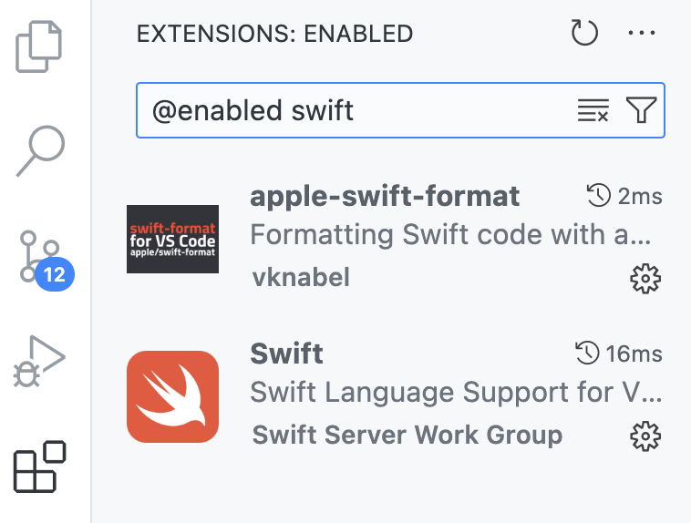
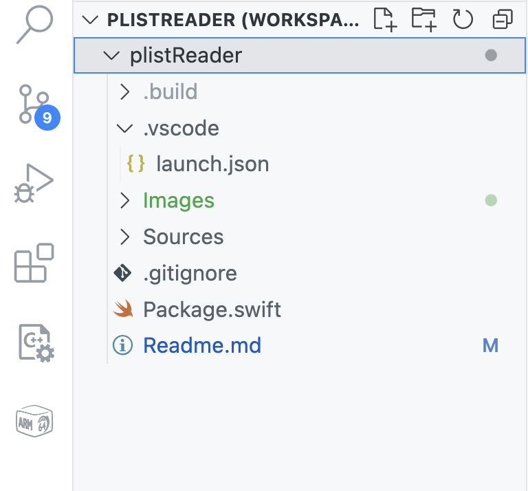
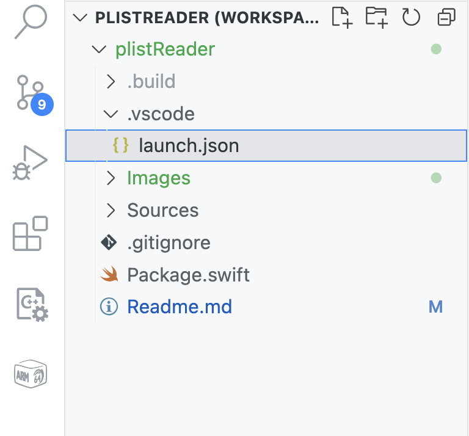
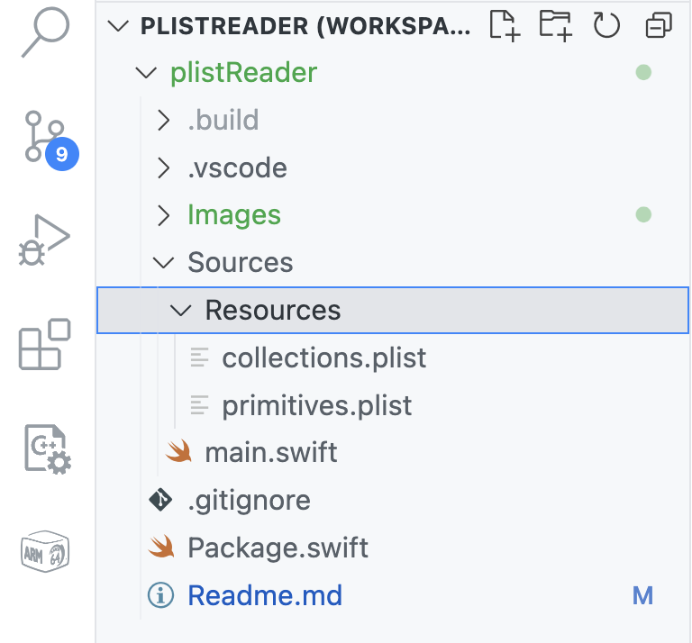
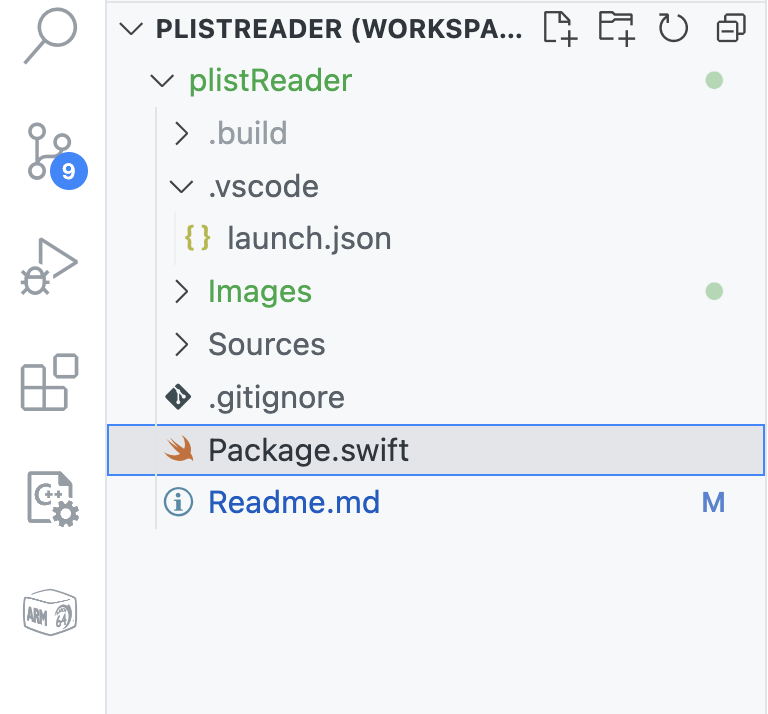
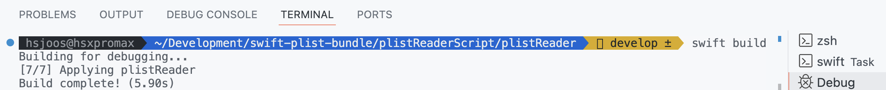
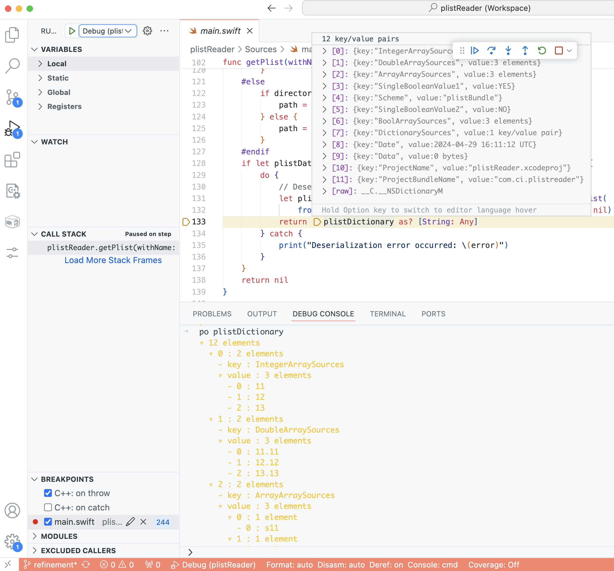

# Mastering property lists in Swift on macOS and iOS

## What are property lists and what are they used for in the Apple eco system ?
Property list files are a type of configuration file that is very commonly used in macOS and iOS applications. They store, for example, user settings, application configurations and system information in a key–value structured format. `.plist` files contain various data types such as _dictionaries, arrays, strings, Boolean_ values and _numbers_. In addition they also can contain `date` and `data` values to wrap nearly all important data types. 
They are usually saved either in XML format or as binary files. This means that audio, video or image files are wrapped as data types.

Related [DTD link](http://www.apple.com/DTDs/PropertyList-1.0.dtd) to get the complete language definition to Apple´s .pist content format description.

Using `.plist` files in Swift is a common practice for managing configuration data in iOS and macOS applications.

Here's a commonly used approach how to read and parse `.plist` files in Swift:

1. Reading and evaluating .plist files in swift, you first need to determine its path. If the file is part of your project and was packed with the Swift Package Manager (SPM), you can use `Bundle.module.path(forResource:ofType:)` to get the path to the file. If you use the plistReader script on commandline, the `.plist` file has to be located in the same folder as the script. Our code takes this into account with the help of the compiler directive `#if SWIFT_PACKAGE`.
2. Reading the data once you have the path to the file, you can read its contets into a data object. This is done by using `FileManager.default.contents(atPath:)`.
3. Serializing the data to convert the XML data into Swift structures, use `PropertyListSerialization.propertyList(from:options:format:)`. This method attempts to deserialize the raw data into a Swift-compatible format (usually a _dictionary_ or _array_).
4. Evaluating the data after serialization, you can access the converted data and use it according to your application logic. Since `.plist` files mosly contain dictionary structures, access is typically done through key-value pairs.
## Special considerations for processing with macOS and iOS
### Deserialization with `PropertyListSerialization` creates `NSObject` class items
As one problem the deserialization of a boolean property, with the swift values of `true` or `false` is mapped to `1` or `2`, which can't be distinguished from the integer values `1` and `2`. For that reason, our `plistReaderScript` is using the NSObject class types to get the correct type values from the `.plist` file deserialization.

## The only files required for program execution
- `main.swift` executable command line script
- `collections.plist` example property list containing additionaly nested collections, like arrays and dictionaries
- `primitives.plist` simple example array of terminal primitive values, like integer, floating point numbers, strings and booleans.

To run the script, you only need `main.swift` and the `.plist` file to be analyzed. In addition to the two example property list files, you can of course use any `.plist` file of your own.
# This `plistReader` project in Visual Studio Code
This swift script project shows in detail which special features must be taken into account for the interaction of the used Swift classes and the underlying Foundation and Core Foundation objects.

The core component is the `plistReader` script, which I integrate into _**Visual Studio Cod**e_ IDE as project for convenient playing around, customization or further development. This also provides a debugging environment for all of you, who are interested and don't have Apples _Xcode_ IDE available.

## Required Swift extensions
I recomend two swift extensions for your eficient work with Swift in VS Code. They are important for: Code completion, documentation references, formatters, syntax highlighting, Swift Package Manager, debugging and more.



## Project structure in _VS Code_
|||
|:---:|:---:|
|Project name|Launch description|
|||
|Resources Folder|Swift Package description|
|||
|||

## Compile and generate the project bundle folder
If the _VS Studio_ project is organized like that, you can execute `swift build`in the terminal of the _VS Studio_ command line to generate the `.build` folder, that contains the complete bundled code with all required resources, to provide great debug features.



## Start a debug session in VS Code

## Example print results of the included `collections.plist`
### Chatty output info
.. with additional information about the item types. In particular, the object type ids and object class names of the required NSObject and Core Foundation classes
```bash
Swift Dictionary
Object class TypeID: 18
Object class type name: __NSDictionaryM
key: DictionarySources, type: Dictionary<String, Any>
    Swift Dictionary
    Object class TypeID: 18
    Object class type name: __NSDictionaryM
    key: Dictionary inside a Dictionary, type: Dictionary<String, Any>
        Swift Array
        Object class TypeID: 19
        Object class type name: __NSArrayM
        key: InsideIntegerArraySources, type: Array<Any>
            Swift Integer:
            Object class TypeID: 22
            Object class type name: __NSCFNumber
            value: 11, type: Int
            Swift Integer:
            Object class TypeID: 22
            Object class type name: __NSCFNumber
            value: 22, type: Int
            Swift Integer:
            Object class TypeID: 22
            Object class type name: __NSCFNumber
            value: 33, type: Int
        --------------------------------------------------
        Swift String
        Object class TypeID: 7
        Object class type name: __NSCFString
        key: d1, type: String
        value: string value from d1, type: String
        --------------------------------------------------
        Swift Integer:
        Object class TypeID: 22
        Object class type name: __NSCFNumber
        key: di1, type: Int
        value: true, type: Int
        --------------------------------------------------
        Swift Array
        Object class TypeID: 19
        Object class type name: __NSArrayM
        key: InsideStringArraySources, type: Array<Any>
            Swift String
            Object class TypeID: 7
            Object class type name: __NSCFString
            value: item1, type: String
            Swift String
            Object class TypeID: 7
            Object class type name: __NSCFString
            value: item2, type: String
            Swift String
            Object class TypeID: 7
            Object class type name: __NSCFString
            value: item3, type: String
        --------------------------------------------------
        Swift Array
        Object class TypeID: 19
        Object class type name: __NSArrayM
        key: BoolArraySources, type: Array<Any>
            Swift Bool
            Object class TypeID: 21
            Object class type name: __NSCFBoolean
            value: true, type: Bool
            Swift Bool
            Object class TypeID: 21
            Object class type name: __NSCFBoolean
            value: false, type: Bool
            Swift Bool
            Object class TypeID: 21
            Object class type name: __NSCFBoolean
            value: true, type: Bool
        --------------------------------------------------
    --------------------------------------------------
--------------------------------------------------
        ...
```
### Reduced output info
.. only with the _key-value-pairs_ of each item.

Please note that we have the same property list file in both cases. The items are only arranged in a different order, as the order of the values is not predefined for property lists.
```bash
kkey: StringArraySources, type: Array<Any>
    value: 1st string, type: String
    value: 2nd string, type: String
    value: 3rd string, type: String
key: DoubleArraySources, type: Array<Any>
    value: 11.11, type: Double
    value: 12.12, type: Double
    value: 13.13, type: Double
key: SingleBooleanValue2, type: Bool
value: false, type: Bool
key: ProjectBundleName, type: String
value: com.ci.plistreader, type: String
key: Scheme, type: String
value: plistBundle, type: String
key: DictionarySources, type: Dictionary<String, Any>
    key: Dictionary inside a Dictionary, type: Dictionary<String, Any>
        key: InsideStringArraySources, type: Array<Any>
            value: item1, type: String
            value: item2, type: String
            value: item3, type: String
        key: InsideIntegerArraySources, type: Array<Any>
            value: 11, type: Int
            value: 22, type: Int
            value: 33, type: Int
        key: d1, type: String
        value: string value from d1, type: String
        key: BoolArraySources, type: Array<Any>
            value: true, type: Bool
            value: false, type: Bool
            value: true, type: Bool
        key: di1, type: Int
        value: true, type: Int
key: IntegerArraySources, type: Array<Any>
    value: 11, type: Int
    value: 12, type: Int
    value: 13, type: Int
key: BoolArraySources, type: Array<Any>
    value: true, type: Bool
    value: false, type: Bool
    value: true, type: Bool
key: ProjectName, type: String
value: plistReader.xcodeproj, type: String
key: SingleBooleanValue1, type: Bool
value: true, type: Bool
```
# How it works
## Let's dive into the code
### 1. Import required framework
```swift
import Foundation
```
We have to import the `Foundation` framework because the `PropertyListSerialization` used in our program is an `NSObject` class that has to be bridged to the Swift type system.
### 2. Define the message structure and the desired type info level

```swift
var indentSpace = ""
let indentValue = "    "
let scriptSourceDefaultPath = "./"

let printflag_swiftType = PrintFlag.on
let printflag_objectClassType = PrintFlag.on
let printflag_ObjectClassTypeName = PrintFlag.on
let printflag_separator = PrintFlag.on

enum PrintFlag {
  case on
  case off

  var isOn: Bool {
    switch self {
    case .on:
      return true
    case .off:
      return false
    }
  }
}

func printWithIndent(_ info: String, toggle: PrintFlag = .on) {
  if toggle.isOn {
    print("\(indentSpace)\(info)")
  }
}
```
The properties are displayed with _key_, _value_ and _type_ in a clearly arranged output format. In particular, nested arrays and dictionaries are shown with their respective hierarchy levels.
### 3. Find the type of related item from `.plist` data file

```swift
/// Collect  item type from NSObject plist element and return respective Swift type
/// - Parameter item: dictionary element
/// - Returns: Swift type
func getCollectionType<T>(item: Any, valueWithType: T) -> T {
  var plistElementType: Any
  let valueWithObjectType = valueWithType as! NSObject
  let typeID = CFGetTypeID(valueWithObjectType)

  switch typeID {
  case CFBooleanGetTypeID():
    printWithIndent("Swift Bool", toggle: printflag_swiftType)
    printWithIndent("Object class TypeID: \(typeID)", toggle: printflag_swiftType)
    plistElementType = Bool.self
  case CFDictionaryGetTypeID():
    printWithIndent("Swift Dictionary", toggle: printflag_swiftType)
    printWithIndent("Object class TypeID: \(typeID)", toggle: printflag_objectClassType)
    plistElementType = Dictionary<String, Any>.self
  case CFArrayGetTypeID():
    printWithIndent("Swift Array", toggle: printflag_swiftType)
    printWithIndent("Object class TypeID: \(typeID)", toggle: printflag_objectClassType)
    plistElementType = Array<Any>.self
  case CFDataGetTypeID():
    printWithIndent("Swift Data", toggle: printflag_swiftType)
    printWithIndent("Object class TypeID: \(typeID)", toggle: printflag_objectClassType)
    plistElementType = Data.self
  case CFDateGetTypeID():
    printWithIndent("Swift Date", toggle: printflag_swiftType)
    printWithIndent("Object class TypeID: \(typeID)", toggle: printflag_objectClassType)
    plistElementType = Date.self
  case CFStringGetTypeID():
    printWithIndent("Swift String", toggle: printflag_swiftType)
    printWithIndent("Object class TypeID: \(typeID)", toggle: printflag_objectClassType)
    plistElementType = String.self
  case CFNumberGetTypeID():
    let valueWithNumberObjectType = valueWithType as! NSNumber
    if CFNumberIsFloatType(valueWithNumberObjectType) {
      plistElementType = Double.self
      printWithIndent("Swift Double:", toggle: printflag_objectClassType)
    } else {
      plistElementType = Int.self
      printWithIndent("Swift Integer:", toggle: printflag_objectClassType)
    }
    printWithIndent("Object class TypeID: \(typeID)", toggle: printflag_objectClassType)
  default:
    plistElementType = Any.self
    printWithIndent("Object class TypeID-default: \(typeID)", toggle: printflag_objectClassType)
  }
  return plistElementType.self as! T
}
```
The method maps the `.plist` elements Core Foundation Types `CFTypeID` to the corresponding Swift type. As already mentioned, this is necessary because the serialized property list that we read in from the `.plist` file is now available to us in the Core Foundation type system. This is particularly important for data types such as Boolean and Numbers, as integer and Boolean values, for example, cannot be uniquely assigned to each other.

The printflags `printflag_swiftType` and `printflag_objectClassType` can be used to easily control what should appear and not to clutter up the output. But we also have more information if needed, if we switch on all the print flags.

Finally the function uses the found `CFType` casting it to the Swift type system and return it to caller.

#### What exactly happens here in the cast ?

For example, if we have an `__NSCFBoolean` at runtime, this is typed as `NSNumber` but may actually be an instance of `__NSCFBoolean` and it represents a boolean value. By casting the value to a Swift `Bool` thanks to Swift's interoperability with Objective-C and its automatic handling of Foundation types like `NSNumber`, it results in a Swift `Bool` type with the values of `true` or `false` instead of `1` and `0` from `NSNumber` bools.

Now we got all types from our serialized input `.plist` file as related Swift type values:

`array` | `data` | `date` | `dict` | `real` | `integer` | `string` | `true` | `false`

### 4. Now we create the content information
```swift
/// Create Collection Type
/// - Parameters:
///   - item: deserialized plist item as Core Foundation dictionary
///   - collectionType: collection type dictionary object
///   - genericElementValue: generic element value
/// - Returns: item key, value and type as dictionary
func collectionType<CollectionType>(
  of item: Any, collectionType: CollectionType, genericElementValue: Any
) -> CollectionType {
  let typeAsString = String(describing: type(of: genericElementValue))
  let collectionType = getCollectionType(item: item, valueWithType: genericElementValue)
  var elementValue = genericElementValue
  printWithIndent("Object class type name: \(typeAsString)", toggle: printflag_ObjectClassTypeName)

  if case let adaptedBoolElementValue as Bool = genericElementValue {
    elementValue = adaptedBoolElementValue
  }
  if let element = item as? Dictionary<String, Any>.Element {
    return ["key": element.key, "value": elementValue, "type": collectionType] as! CollectionType
  }
  return [String(describing: collectionType)] as! CollectionType
}
```

For each `.plist` item we create its content information as ___key___, ___value___ and its ___type___. Provide all in a dictionary or array collection as the functions return value.

The caller always knows whether it requires an array or a dictionary, and therefore an instance of this expected collection type is passed at the call point.

### 5. We read the sample `.plist` file and deserialize the elements into a dictionary
```swift
/// File manager will fetch plist file from compiled commandline tool as well as from swift script
/// - Parameter name: plist file name
/// - Returns: plist ad generic dictionary
func getPlist(withName name: String) -> [String: Any]? {
  var path: String?
  var fileName = name
  let fileType = ".plist"

  if name.hasSuffix(fileType) {
    fileName = name.split(separator: ".").dropLast().joined(separator: ".")
  }

  #if SWIFT_PACKAGE
    if let bundlePath: String = Bundle.module.path(forResource: fileName, ofType: fileType) {
      path = bundlePath
    }
  #else
    path = scriptSourceDefaultPath + "\(fileName)" + fileType
  #endif

  if let plistData = FileManager.default.contents(atPath: path ?? "") {
    do {
      // Deserialize the property list
      let plistDictionary = try PropertyListSerialization.propertyList(
        from: plistData, options: .mutableContainersAndLeaves, format: nil)
      return plistDictionary as? [String: Any]
    } catch {
      print("Deserialization error occurred: \(error)")
    }
  }
  return nil
}
```
The file manager function has to take in account that we habe two different usage scenarios. Therefore we have to take in consideration if we run the code from an app bundle or from a plain script source from the command line.
### 6. Print formatted `.plist` items
```
func printItem(data: [String: Any]) {

  enum Indent {
    case addSpace
    case reduceSpace
  }

  func adaptIndentation(_ adapt: Indent) {
    switch adapt {
    case .addSpace:
      indentSpace = indentSpace + indentValue
    case .reduceSpace:
      indentSpace.removeFirst(indentValue.count)
    }
  }

  for item in data {
    let resultDictionary = collectionType(
      of: item, collectionType: [String: Any](), genericElementValue: item.value)

    guard let resultType = resultDictionary["type"].self else {
      fatalError("type exception !!!")
    }
    guard let resultKey = resultDictionary["key"].self else {
      fatalError("key exception !!!")
    }
    guard let resultValue = resultDictionary["value"].self else {
      fatalError("value exception !!!")
    }
    let typeName = String(describing: resultType)
    switch typeName {
    case "Bool", "Int", "String", "Double":
      printWithIndent("key: \(resultKey), type: \(typeName)")
      printWithIndent("value: \(resultValue), type: \(typeName)")
    case "Dictionary<String, Any>":
      printWithIndent("key: \(resultKey), type: \(typeName)")
      adaptIndentation(.addSpace)
      printItem(data: item.value as! [String: Any])
      adaptIndentation(.reduceSpace)
    case "Array<Any>":
      printWithIndent("key: \(resultKey), type: \(typeName)")
      adaptIndentation(.addSpace)
      for arrayElement in item.value as! [Any] {
        let typeArray = collectionType(
          of: arrayElement, collectionType: [Any](), genericElementValue: arrayElement.self)
        var elementValue = arrayElement
        if case let adaptedBoolElementValue as Bool = arrayElement {
          elementValue = adaptedBoolElementValue
        }
        let elementType = typeArray.first!
        printWithIndent("value: \(elementValue), type: \(elementType as! String)")
      }
      adaptIndentation(.reduceSpace)
    default:
      print("Error! type \(typeName) not found")
    }
    printWithIndent(
      "--------------------------------------------------", toggle: printflag_separator)
  }
}
```

### The code will be executed for two different source locations
#### 1st – call on command line with Swift source code interpreter, where the swift source file is located in the same folder as the input plist file.
###### `swift main.swift <plist-file>`
```
.
├── collections.plist
├── main.swift
└── primitives.plist

1 directory, 3 files
```
First you can run it as a simple command line script, where you only need a Swift interpreter installed on our computer. In this case you only need the Swift source code file `main.swift` and one example `.plist` file like our included `collections.plist`, the simpler `primitives.plist` or your own important example file.
#### 2nd – run from VS Code from the build bundle
##### `F5` for debug or `^F5` run without debug
**Attention !**

Please be aware, that allways after some changes in the code or any othe modification in the project, you have to run `swift build` in the VS Code project terminal.
Therefore see my screenshot and description above for VS Code debug session execution and `swift build`

**before first `swift build`**
```bash
.
├── .vscode
│   └── launch.json
├── Package.swift
├── Readme.md
└── Sources
    ├── Resources
    │   ├── collections.plist
    │   └── primitives.plist
    └── main.swift

4 directories, 6 files
```
**after executing `swift build`**

```bash
.
├── .build
│   ├── arm64-apple-macosx
│   │   ├── build.db
│   │   └── debug
│   ├── artifacts
│   ├── checkouts
│   ├── debug -> arm64-apple-macosx/debug
│   ├── debug.yaml
│   ├── repositories
│   └── workspace-state.json
├── .vscode
│   └── launch.json
├── Package.swift
├── Readme.md
└── Sources
    ├── Resources
    │   ├── collections.plist
    │   └── primitives.plist
    └── main.swift

11 directories, 9 files
```


