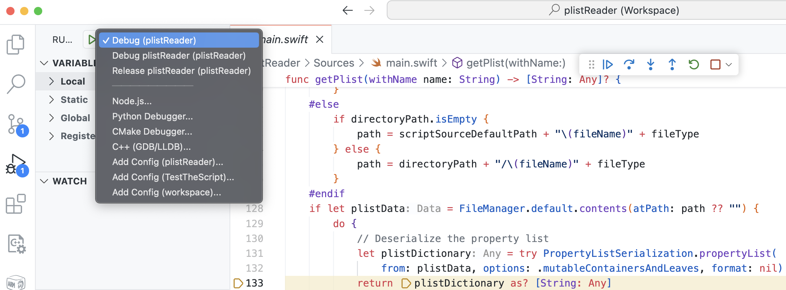

# Developing a Property List Analyzer Script in Swift for iOS and macOS, Using Visual Studio Code

## This project demonstrates:
1. Special handling of `.plist` files for macOS and iOS.
2. An easy-to-use script for the Swift source code interpreter.
3. Swift programming capabilities in Visual Studio Code.
4. Include `Package.swift` to integrate a macOS application bundle in the `.build` directory and to also provide a compiled binary as `plistReader` command line tool.
5. Enable syntax highlighting, code completion, and debugging for macOS Swift application development using Visual Studio Code.
## What are property lists (`.plists`) and what are they used for in the Apple eco system ?
Property list files, commonly used in macOS and iOS applications, are configuration files that store data such as user settings, application configurations, and system information in a key-value structured format. 

`.plist` files can include a variety of data types, including dictionaries, arrays, strings, Boolean values, and numbers, as well as date and data values to encompass nearly all essential data types. Typically, these files are saved in either XML format or as binary files, and they can also encapsulate audio, video, or image files as data types.

Related [DTD link](http://www.apple.com/DTDs/PropertyList-1.0.dtd) to get the complete language definition to Apple´s .pist content format description.

Using `.plist` files in Swift is a common practice for managing configuration data in iOS and macOS applications.

Here's a commonly used approach how to read and parse `.plist` files in Swift on macOS:

1. Reading and evaluating `.plist` files in swift on macOS, you first need to determine its path. If the file is part of your project and was packed with the [Swift Package Manager (SPM)](https://www.swift.org/documentation/package-manager/), you can use `Bundle.module.path(forResource:ofType:)` to get the path to the file. If you use the plistReader script on the command line, the `.plist` input file is found under the path, that is specified as a parameter in the command line. The code takes this into account with the help of the compiler directive `#if SWIFT_PACKAGE`.
2. Reading the data once you have the path to the file, you can read its contets into a data object. This is done by using `FileManager.default.contents(atPath:)`.
3. Serializing the data to convert the XML data into Swift structures, use `PropertyListSerialization.propertyList(from:options:format:)`. This method attempts to deserialize the raw data into a Swift-compatible format (usually a _dictionary_ or _array_).
4. Evaluating the data after serialization, you can access the converted data and use it according to your application logic. Since `.plist` files mosly contain dictionary structures, access is typically done through key-value pairs.
## Special considerations for processing with macOS
### Deserialization with `PropertyListSerialization` creates `NSObject` class items
As one problem the deserialization of a boolean property, with the swift values of `true` or `false` is mapped to `1` or `2`, which can't be distinguished from the integer values `1` and `2`. For that reason, our `plistReaderScript` is using the NSObject class types to get the correct type values from the `.plist` file deserialization.

# Implementing the macOS `plistReader` Script with Visual Studio Code
This Swift script project provides a detailed exploration of the specific features that must be considered when using Swift classes in conjunction with Foundation and Core Foundation objects.

The `plistReader` script is seamlessly integrated into the __Visual Studio Code__ IDE as a project, enabling easy experimentation, customization, or further development. This setup also offers a robust debugging environment, making it ideal for those who do not have access to Apple's __Xcode__ IDE or prefer the familiarity of __Visual Studio Code__.

## Required Swift Environment Setup for Apple Platforms
The script requires the Apple `Foundation` framework, which is pre-installed on every development Mac that has Xcode. If Xcode is not installed on your Mac, you will at least need the Xcode Command Line Tools.

To check if the Command Line Tools are installed, use the command:
```bash
xcode-select -p
```
If they are installed and Xcode is also present, they typically reside within the Xcode bundle at:
```bash
/Applications/Xcode.app/Contents/Developer
```
If only the Command Line Tools are installed, the path may instead point to:
```bash
/Library/Developer/CommandLineTools
```
If the Command Line Tools are not installed on your Mac, you can install them using:
```bash
xcode-select --install
```
## Required Swift extensions for VS Code
I recommend two Swift extensions for efficient work with Swift in VS Code, essential for code completion, documentation references, formatters, syntax highlighting, managing Swift packages, debugging, and more.


## Project structure in _VS Code_
|||
|:---:|:---:|
|1. Project root|2. Launch configuration|
|||
|3. Resources Folder|4. Swift Package description|
|||

#### 1. Project root
`plistReader` is the top folder name aka as project directory and is also the project name.
#### 2. Launch configuration
The `.vscode` folder contains the `launch.json` file with all project related information for VS code. In our configuration here it contains the required instructions to copy our two example plist files to the bundle during the build process and after successful compilation of `main.swift` the bundle contains the compiled `plistReader` binary which will be copied to the project root folder.
#### 3. Resources Folder
The `Sources` folder houses the `main.swift` source file at the top level, while the `Resources` subfolder contains all files required by the project bundle post-compilation.
#### 4. Swift Package description
The `Package.swift` file created with the [Swift Package Manager (SPM)](https://www.swift.org/documentation/package-manager/) is necessary solely for enabling Swift bundle management in VS Code.
```bash
import PackageDescription

let package = Package(
    name: "plistReader",
    targets: [
        .executableTarget(
            name: "plistReader",
            resources: [
                .process("Resources") // This will include all files in the 'Resources' directory
            ]
        )
    ]
)
```
Our `Package.swift` file contains only essential configuration information, enabling VS Code to use the Swift compiler during the build process and specifying the project name and resources folder.

## Compile and generate the project bundle folder
If the _VS Studio_ project is organized like that, you can execute `swift build`in the terminal of the _VS Studio_ command line to generate the `.build` folder, that contains the complete bundled code with all required resources, to provide great debug features.


## Debug session in VS Code
### Debug session
- set breakpoints first
- run the debug session


### Reveal data at breakpoints
- Hovering over variables displays their values in a popup.
- Enter debug commands such as `po <variable-name>` in the `DEBUG CONSOLE` located at the bottom of VS Code.


## Example print results of the included `collections.plist`
### Verbose output information
.. including detailed descriptions of item types, specifically object type IDs and class names for the required NSObject and Core Foundation classes.

Set boolean constants to their `.on` state:
```bash
let printflag_swiftType             = PrintFlag.on
let printflag_objectClassType       = PrintFlag.on
let printflag_ObjectClassTypeName   = PrintFlag.on
let printflag_separator             = PrintFlag.on
```
You get the output:
```bash
---------------------------------------------
Object class TypeID: 19
Object class Name: __NSArrayM
key: ArrayArraySources
Swift Type: Array<Any>
    -----------------------------------------
    Object class TypeID: 19
    Object class Name: __NSArrayM
    Swift Type: Array<Any>
        -------------------------------------
        Object class TypeID: 7
        Object class Name: __NSCFString
        value: s11
        Swift Type: String
    -----------------------------------------
    Object class TypeID: 19
    Object class Name: __NSArrayM
    Swift Type: Array<Any>
        -------------------------------------
        Object class TypeID: 7
        Object class Name: __NSCFString
        value: s12
        Swift Type: String
---------------------------------------------
Object class TypeID: 21
Object class Name: __NSCFBoolean
key: SingleBooleanValue1
value: true
Swift Type: Bool
---------------------------------------------
Object class TypeID: 21
Object class Name: __NSCFBoolean
key: SingleBooleanValue2
value: false
Swift Type: Bool
---------------------------------------------
Object class TypeID: 20
Object class Name: __NSCFData
key: Data
value: 5 bytes
Swift Type: Data
---------------------------------------------
Object class TypeID: 42
Object class Name: __NSTaggedDate
key: Date
value: 2024-04-29 16:11:12 +0000
Swift Type: Date
---------------------------------------------
Object class TypeID: 18
Object class Name: __NSDictionaryM
key: DictionarySources
Swift Type: Dictionary<String, Any>
    -----------------------------------------
    Object class TypeID: 19
    Object class Name: __NSArrayM
    key: BoolArraySources
    Swift Type: Array<Any>
        -------------------------------------
        Object class TypeID: 21
        Object class Name: __NSCFBoolean
        value: true
        Swift Type: Bool
        -------------------------------------
        Object class TypeID: 21
        Object class Name: __NSCFBoolean
        value: false
        Swift Type: Bool
    -----------------------------------------
    Object class TypeID: 18
    Object class Name: __NSDictionaryM
    key: Dictionary inside a Dictionary
    Swift Type: Dictionary<String, Any>
        -------------------------------------
        Object class TypeID: 19
        Object class Name: __NSArrayM
        key: InsideIntegerArraySources
        Swift Type: Array<Any>
            ---------------------------------
            Object class TypeID: 22
            Object class Name: __NSCFNumber
            value: 11
            Swift Type: Int
            ---------------------------------
            Object class TypeID: 22
            Object class Name: __NSCFNumber
            value: 22
            Swift Type: Int
        -------------------------------------
        Object class TypeID: 19
        Object class Name: __NSArrayM
        key: InsideStringArraySources
        Swift Type: Array<Any>
            ---------------------------------
            Object class TypeID: 7
            Object class Name: __NSCFString
            value: item1
            Swift Type: String
            ---------------------------------
            Object class TypeID: 7
            Object class Name: __NSCFString
            value: item2
            Swift Type: String
        -------------------------------------
        Object class TypeID: 7
        Object class Name: __NSCFString
        key: d1
        value: string value from d1
        Swift Type: String
        -------------------------------------
        Object class TypeID: 22
        Object class Name: __NSCFNumber
        key: di1
        value: 1
        Swift Type: Int
---------------------------------------------
Object class TypeID: 7
Object class Name: __NSCFString
key: ProjectName
value: plistReader
Swift Type: String
```
### Condensed output information
.. featuring only the key-value pairs for each item.

Please note that the same property list file is used in both cases. However, the items are arranged differently because the order of values in property lists is not predefined.

Set boolean constants to their .off state:
```bash
let printflag_swiftType             = PrintFlag.off
let printflag_objectClassType       = PrintFlag.off
let printflag_ObjectClassTypeName   = PrintFlag.off
let printflag_separator             = PrintFlag.off
```
You get the output:
```bash
key: SingleBooleanValue1
value: true
key: SingleBooleanValue2
value: false
key: ProjectName
value: plistReader
key: Date
value: 2024-04-29 16:11:12 +0000
key: DictionarySources
    key: Dictionary inside a Dictionary
        key: InsideStringArraySources
            value: item1
            value: item2
        key: d1
        value: string value from d1
        key: di1
        value: 1
        key: InsideIntegerArraySources
            value: 11
            value: 22
    key: BoolArraySources
        value: true
        value: false
key: ArrayArraySources
        value: s11
        value: s12
key: Data
value: 5 bytes
```
# How it works
## Let's dive into the code
### 1. Import required framework
```swift
import Foundation
```
We have to import the `Foundation` framework because the `PropertyListSerialization` used in our program is an `NSObject` class that has to be bridged to the Swift type system.
### 2. Define the message structure and the desired type info level

```swift
var indentSpace = ""
let indentCharacter = " "
let indentString = String(repeating: indentCharacter, count: 4)

let separatorCharacter = "-"
var separatorString = String(repeating: separatorCharacter, count: 45)

let scriptSourceDefaultPath = "./"

let printflag_swiftType             = PrintFlag.off
let printflag_objectClassType       = PrintFlag.off
let printflag_ObjectClassTypeName   = PrintFlag.off
let printflag_separator             = PrintFlag.off

enum PrintFlag {
    case on
    case off
    
    var isOn: Bool {
        switch self {
        case .on:
            return true
        case .off:
            return false
        }
    }
}

enum ItemType: String{
    case array = "Array<Any>"
    case dictionary = "Dictionary<String, Any>"
    case string = "String"
    case boolean = "Bool"
    case integer = "Int"
    case double = "Double"
    case data = "Data"
    case date = "Date"
}

func printWithIndent(_ info: String, toggle: PrintFlag = .on) {
    if toggle.isOn {
        print("\(indentSpace)\(info)")
    }
}
```
The properties are displayed in a clearly arranged output format, showing key, value, and type. Nested arrays and dictionaries are presented with their respective hierarchical levels.
### 3. Determine the type of related item from the `.plist` data file

```swift
/// Collect  item type from NSObject plist element and return respective Swift type
/// - Parameter item: dictionary element
/// - Returns: Swift type
func getItemType(itemValue: Any) -> Dictionary<String, Any> {
    var plistElementType: Any
    let valueWithObjectType = itemValue as! NSObject
    let typeID = CFGetTypeID(valueWithObjectType)
    
    switch typeID {
    case CFBooleanGetTypeID():
        plistElementType = Bool.self
    case CFDictionaryGetTypeID():
        plistElementType = Dictionary<String, Any>.self
    case CFArrayGetTypeID():
        plistElementType = Array<Any>.self
    case CFDataGetTypeID():
        plistElementType = Data.self
    case CFDateGetTypeID():
        plistElementType = Date.self
    case CFStringGetTypeID():
        plistElementType = String.self
    case CFNumberGetTypeID():
        let valueWithNumberObjectType = itemValue as! NSNumber
        if CFNumberIsFloatType(valueWithNumberObjectType) {
            plistElementType = Double.self
        } else {
            plistElementType = Int.self
        }
    default:
        plistElementType = Any.self
    }
    return [ "SwiftType": plistElementType.self, "ObjectType": typeID, "ObjectClassName": String(describing: type(of: itemValue)) ]
}
```
The method maps the `.plist` elements, specifically Core Foundation Types `CFTypeID`, to their corresponding Swift types. This mapping is crucial because the serialized property list we retrieve from the `.plist` file is presented in the Core Foundation type system. This process is especially important for data types like Booleans and Numbers, given that integer and Boolean values, for instance, cannot be uniquely correlated.

The printflags `printflag_swiftType` and `printflag_objectClassType` can be used to easily control what should appear and not to clutter up the output. But we also have more information if needed, if we switch on all the print flags.

Finally, the function casts the identified `CFType` to the Swift type system and returns it to the caller.

#### What exactly occurs during the casting process?

For example, if we have an `__NSCFBoolean` at runtime, this is typed as `NSNumber` but may actually be an instance of `__NSCFBoolean` and it represents a boolean value. By casting the value to a Swift `Bool` thanks to Swift's interoperability with Objective-C and its automatic handling of Foundation types like `NSNumber`, it results in a Swift `Bool` type with the values of `true` or `false` instead of `1` and `0` from `NSNumber` bools.

Now, we have converted all types from our serialized `.plist` file into corresponding Swift type values:

`array` | `data` | `date` | `dict` | `real` | `integer` | `string` | `true` | `false`

For each `.plist` item we create its content information as ___key___, ___value___ and its ___type___. Provide all in a dictionary or array collection as the functions return value.

The caller always knows whether it requires an array or a dictionary, and therefore an instance of this expected collection type is passed at the call point.

### 4. We read the sample `.plist` file and deserialize the elements into a swift dictionary
```swift
/// File manager will fetch plist file from compiled commandline tool as well as from swift script
/// - Parameter name: plist file name
/// - Returns: plist as dictionary
func getPlist(withName name: String) -> [String: Any]? {
  var path: String?
  let fullPath = name
  let fileType = ".plist"
  var fileName = (fullPath as NSString).lastPathComponent
  let directoryPath = (fullPath as NSString).deletingLastPathComponent
  if fileName.hasSuffix(fileType) {
    fileName = fileName.split(separator: ".").dropLast().joined(separator: ".")
  }

  #if SWIFT_PACKAGE
    if directoryPath.isEmpty {
      if let bundlePath: String = Bundle.module.path(forResource: fileName, ofType: fileType) {
        path = bundlePath
      }
    } else {
      path = directoryPath + "/\(fileName)" + fileType
    }
  #else
    if directoryPath.isEmpty {
      path = scriptSourceDefaultPath + "\(fileName)" + fileType
    } else {
      path = directoryPath + "/\(fileName)" + fileType
    }
  #endif

  if let plistData = FileManager.default.contents(atPath: path ?? "") {
    do {
      // Deserialize the property list
      let plistDictionary = try PropertyListSerialization.propertyList(
        from: plistData, options: .mutableContainersAndLeaves, format: nil)
      return plistDictionary as? [String: Any]
    } catch {
      print("Deserialization error occurred: \(error)")
    }
  }
  return nil
}
```
The file manager function must support two distinct usage scenarios: executing compiled binary code from an app bundle or running a standalone source code script using the Swift interpreter directly from the command line.
### 5. Print formatted `.plist` items
This function serves as the workhorse of the little project. Initially, it takes a complete property list as input, which it reads from the data parameter as a dictionary previously retrieved via input path command line parameter from the file system. The property list may include terminal property objects such as _strings_, _numbers_, _booleans_, _date_ and _data_. Additionally, it features _collections_ like _dictionaries_ and _arrays_ that can contain all item types, leading to a potentially infinitely nested structure. This results in a typically recursive data structure, because they may contain collections again.

#### Understanding how this function operates
The for loop analyzes each item to determine its type.
- For primitive types, we gather all the type information and print it on its indentation position, corresponding to its current hierarchical level.
- For collection types, we increase the indentation and recursively call this function with the current item and the `ItemType` type as parameters.
- `printItemInfo(:)` prepares the output line based on the current item type, while the predefined `printFlag_...` determines whether the related type information is also printed.

```swift
/// Get nested elements and display the hierarchical plist structure
/// - Parameter data:
func getItemInfo(data: [String: Any], insideCollectionType: ItemType) {
    
    enum Indent {
        case addSpace
        case reduceSpace
    }
    
    func adaptIndentation(_ adapt: Indent) {
        switch adapt {
        case .addSpace:
            indentSpace = indentSpace + indentString
            separatorString.removeLast(indentString.count)
        case .reduceSpace:
            indentSpace.removeFirst(indentString.count)
            separatorString.append(String(repeating: separatorCharacter, count: indentString.count))
        }
    }
    
    func printItemInfo(item: [String: Any]) {

        let currentSwiftItemType = ItemType(
            rawValue: (String(describing: item["SwiftType"] ?? "")))
        printWithIndent(
            "Object class TypeID: \(item["ObjectType"] ?? "")",
            toggle: printflag_objectClassType)
        printWithIndent(
            "Object class Name: \(item["ObjectClassName"] ?? "")",
            toggle: printflag_ObjectClassTypeName
        )
        if insideCollectionType == .dictionary {
            printWithIndent("key: \(item["key"] ?? "")")
        }
        if ![.dictionary, .array].contains(currentSwiftItemType) {
            printWithIndent("value: \(item["value"] ?? "")")
        }
        printWithIndent("type: \(currentSwiftItemType?.rawValue ?? "")", toggle: printflag_swiftType)
    }

    for item in data {
        var resultDictionary = getItemType(itemValue: item.value)
        guard let swiftType = resultDictionary["SwiftType"].self else {
            fatalError("type exception !!!")
        }
        let typeName = String(describing: swiftType)
        let resultKey = item.key
        let resultValue = item.value
        resultDictionary["key"] = resultKey
        resultDictionary["value"] = resultValue

        printWithIndent(separatorString, toggle: printflag_separator)

        switch ItemType(rawValue: typeName) {
        case .boolean:
            resultDictionary["value"] = resultValue as! Bool
            printItemInfo(item: resultDictionary)
        case .integer:
            resultDictionary["value"] = resultValue as! Int
            printItemInfo(item: resultDictionary)
        case .string:
            resultDictionary["value"] = resultValue as! String
            printItemInfo(item: resultDictionary)
        case .double:
            resultDictionary["value"] = resultValue as! Double
            printItemInfo(item: resultDictionary)
        case .date:
            resultDictionary["value"] = resultValue as! Date
            printItemInfo(item: resultDictionary)
        case .data:
            resultDictionary["value"] = resultValue as! Data
            printItemInfo(item: resultDictionary)
        case .dictionary:
            resultDictionary["value"] = resultValue as! Dictionary<String, Any>
            printItemInfo(item: resultDictionary)
            adaptIndentation(.addSpace)
            getItemInfo(data: item.value as! [String: Any], insideCollectionType: .dictionary)
            adaptIndentation(.reduceSpace)
        case .array:
            resultDictionary["value"] = resultValue as! Array<Any>
            printItemInfo(item: resultDictionary)
            adaptIndentation(.addSpace)
            for arrayElement in item.value as! [Any] {
                let resultDictionary = getItemType(itemValue: arrayElement)
                guard let swiftType = resultDictionary["SwiftType"].self else {
                    fatalError("type exception !!!")
                }
                let swiftTypeName = String(describing: swiftType)
                let arrayItem = [swiftTypeName: arrayElement]
                getItemInfo(data: arrayItem, insideCollectionType: .array)
            }
            adaptIndentation(.reduceSpace)
        default:
            print("Error! type \(typeName) not found")
        }
    }
}
```
## 5. The script body
At the start of the script, we set the default .plist file to 'collections'. If the script is launched without any parameters, it will attempt to use `collections.plist` located in the same folder as the script source.

Two different formatted output versions are listed above. One with verbose output, including type infos and one with condensed information, including only key-value pairs.
```swift
// Default file is "collections.plist"
var plistName = "collections"
if CommandLine.argc > 1 {
    plistName = CommandLine.arguments[1]
}
if let data: [String: Any] = getPlist(withName: plistName) {
    getItemInfo(data: data, insideCollectionType: .dictionary)
} else {
    print("no \(plistName).plist file found")
}
```
## The project yields two distinct outcomes tailored to different application environments and use cases
### 1st – Execute from the command line using the Swift source code interpreter

#### The program requires only a few files for execution
- `main.swift`: An executable command-line script.
- `collections.plist`: An example property list that includes nested collections such as arrays and dictionaries.
- `primitives.plist`: A simple example property list containing terminal primitive values, including integers, floating-point numbers, strings, and booleans.

To run the script, you need only `main.swift` and the `.plist` file you wish to analyze. Besides the two provided example property list files, you may use any `.plist` file of your choice.

#### Why must we use `main.swift` for our script's source code?
The primary reason is to demonstrate how the program can be executed directly from the command line without first compiling the Swift source code.

This necessitates including a hashbang line (shebang) in Swift scripts, which enables the file to be executed directly from the command line without requiring the Swift compiler.
```bash
#!/usr/bin/swift
```
In this scenario, the script source code file must be named `main.swift`.
#### Example of how to execute the script from the command line
If we have a folder like that:
```bash
.
├── ExamplePlistFiles
│   ├── collections.plist
│   └── primitives.plist
├── collections.plist
├── main.swift
├── plistReader
└── primitives.plist
```
We can execute the `main.swift` script source code from command line with:
#### 1. No parameter defaults to `collections.plist` 
```bash
swift main.swift
```
#### 2. Include the path
```bash
swift main.swift ./ExamplePlistFiles/primitives.plist
```
#### 3. Usage of our programm as compiled swift command line tool
```bash
./plistReader ./ExamplePlistFiles/primitives.plist
```
In this case we use the compiled binary programm version, copied from the project bundle `"${workspaceFolder}/.build/debug/plistReader"`, which is the related executable binary macOS program file.
You can see this by trying to list its contents, you will be asked to show this binary content.
```bash
less ./plistReader
"./plistReader" may be a binary file.  See it anyway?
```

### 2nd – run from VS Code from the build bundle
##### `F5` for debug or `^F5` run without debug
**Attention !**

Please be aware that you must run `swift build` in the VS Code project terminal after making any changes to the code or other modifications to the project. Refer to the screenshot and description above for guidance on executing a VS Code debug session and performing a swift build.
### Project folder structure
**before first `swift build`**
```bash
.
├── .vscode
│   └── launch.json
├── Package.swift
├── Readme.md
└── Sources
    ├── Resources
    │   ├── collections.plist
    │   └── primitives.plist
    └── main.swift

4 directories, 6 files
```
**after executing `swift build`**

the `.build` folder will be recreated after each build

```bash
.
├── .build
│   ├── arm64-apple-macosx
│   │   ├── build.db
│   │   └── debug
│   ├── artifacts
│   ├── checkouts
│   ├── debug -> arm64-apple-macosx/debug
│   ├── debug.yaml
│   ├── repositories
│   └── workspace-state.json
├── .vscode
│   └── launch.json
├── Package.swift
├── Readme.md
└── Sources
    ├── Resources
    │   ├── collections.plist
    │   └── primitives.plist
    └── main.swift

11 directories, 9 files
```